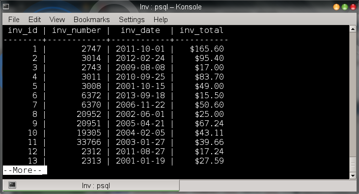
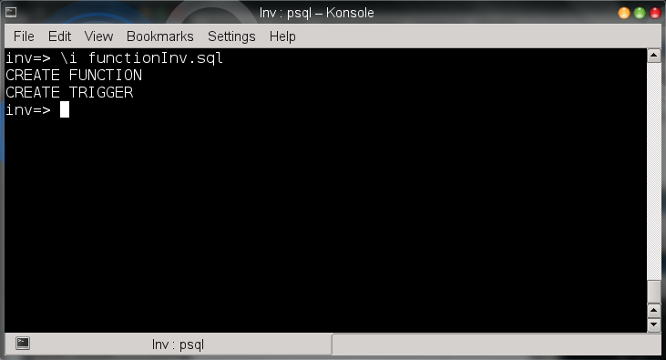
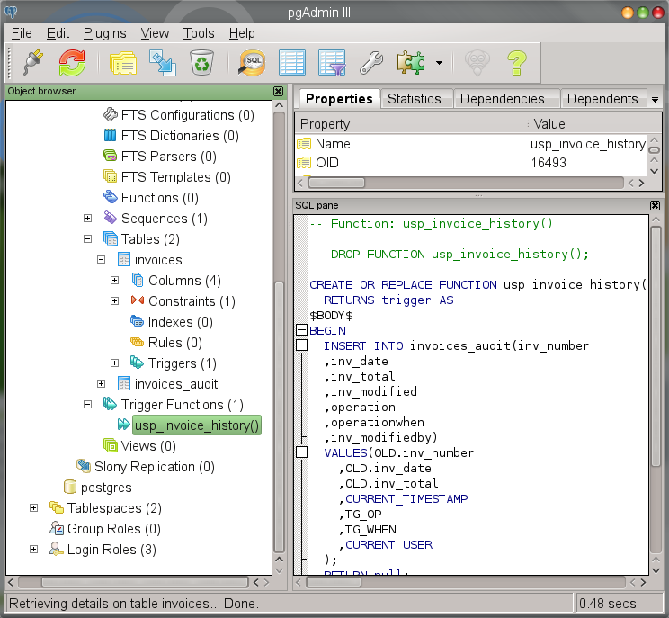
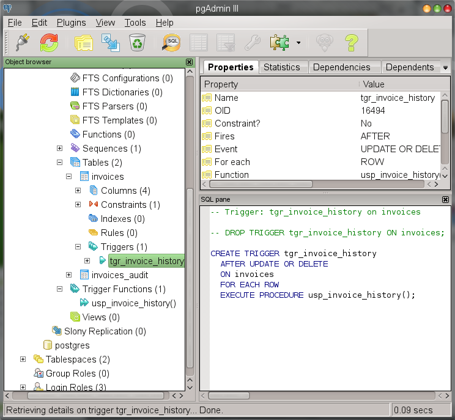
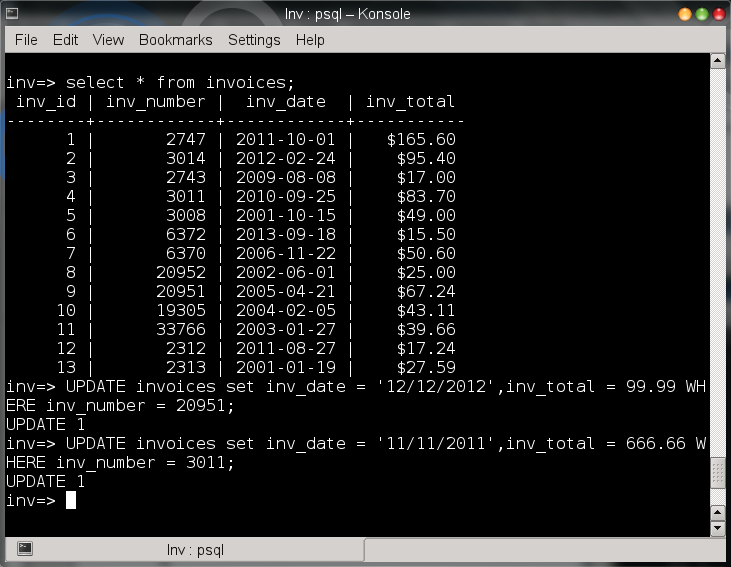
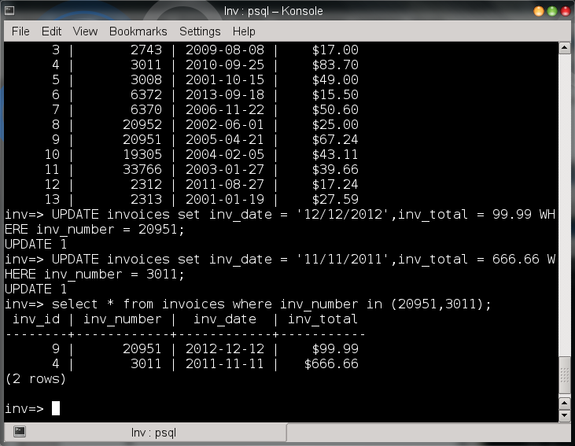
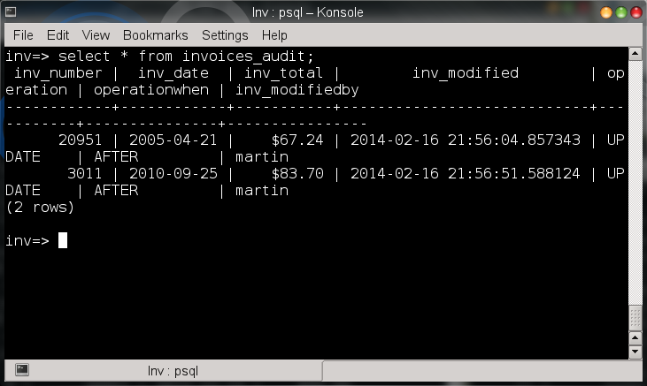

# Utilizando triggers en PostgreSQL

Adicionalmente a la utilización de reglas o constraints, existe otra forma de verificar y mantener la integridad en el DBMS para las aplicaciones, esto se logra mediante los <strong>triggers</strong> (disparadores).
Un <strong>trigger</strong> es básicamente un store procedure o una función del lado del servidor que se dispara cuando una determinada acción INSERT,UPDATE o DELETE se ejecuta cada vez que una fila es modificada.

Aunque los <strong>triggers</strong>  sirven en su mayoría para mantener la integridad de la base de datos también pueden usarse para:

<ul>
<li><strong>Auditoría:</strong>  Los <strong>triggers</strong>  pueden usarse para llenar tablas de auditoría, en donde se registren 
ciertos tipos de transacciones o accesos hacia tablas.</li>
<li><strong>Seguridad:</strong>  Los <strong>triggers</strong>  refuerzan las reglas de seguridad de una aplicación.</li>
<li><strong>Reglas de negocio:</strong> Cuando ciertas reglas de negocio son muy elaboradoras y necesitan ser expresadas a nivel base de datos, es necesario que además de <i>reglas</i> y <i>constraints</i> se utilicen <strong>triggers</strong>.</li>
<li><strong>Validación de datos:</strong> Los <strong>triggers</strong>  pueden controlar ciertas acciones, por ejemplo: pueden rechazar o modificar ciertos valores que no cumplan determinadas reglas, para prevenir que datos inválidos sean insertados en la base.</li>
</ul>

A continuación un ejemplo de la utilización de <strong>triggers</strong> en postgreSQL.

Existe una tabla de facturas como la siguiente:

 

Creamos unas facturas con el script.

Bien esta tabla ya cuenta con algunos registros.

 

Ahora se necesita conocer aquellos registros que por error o intencionalmente cambiaron de fecha o de cantidad. 
Para cumplir con este requerimiento se crea una tabla en donde se guardará el historial de esos cambios.

 

Necesitamos una solución para que cada vez que se borre o se actualice un registro en la tabla <i>invoices</i> se registren los cambios en  <i>invoices_audit</i>.
Bien ya tenemos una razón para crear un <strong>trigger</strong>.

Antes de utilizar un <strong>trigger</strong> es indispensable crear una función trigger <strong>(trigger function)</strong> la cual es similar a un <i>store procedure</i> aunque un poco más restringida y con el acceso a unas variables predefinidas que contienen los valores de la fila que ejecuta el <strong>trigger</strong>, dependiendo de la operación estas variables son:

<ul>
<li><strong>NEW</strong> En la operación INSERT representa el registro que se va a crear, en la operación UPDATE representa el valor del registro después de la actualización.</li>
<li><strong>OLD</strong>  En la operación UPDATE representa el valor antes de la actualización, en la operación DELETE representa el registro que se borrará.</li>
<li><strong>TG_NAME</strong>  El nombre del <strong>trigger</strong>.</li>
<li><strong>TG_WHEN</strong> El instante en el cual se ejecutará el <strong>trigger</strong>, los valores son BEFORE o AFTER.</li>
<li><strong>TG_OP</strong> La acción que dispara el trigger: INSERT, UPDATE o DELETE.</li>
<li><strong>TG_RELNAME</strong> El nombre de la tabla que disparó el <strong>trigger</strong>.</li>
 <li><strong>TG_RELID</strong> El OID de la tabla que disparó el <strong>trigger</strong></li>
 </ul>

Este <strong>trigger function</strong> se crea sin parámetros y con un valor de retorno de tipo trigger, esta función se ejecutará cada vez que una fila es modificada, a continuación el código de la función en donde se muestra el uso de variables predefinidas.

Siendo lo más importante a continuación el código que crea el <strong>trigger</strong> , esto es lo que asocia la tabla con la ejecución de la función.

La sintaxis general para crear un trigger es:

<pre>
CREATE TRIGGER [name] [BEFORE | AFTER] [action]
ON [table] FOR EACH ROW
EXECUTE PROCEDURE [function name(arguments)]
</pre>

Cuando ejecutemos el código de la <strong>función trigger</strong> y de la creación del <strong>trigger</strong> desde un archivo, <strong>PostgreSQL</strong> nos mostrará los siguientes mensajes:

<pre>
CREATE FUNCTION
CREATE TRIGGER
</pre>

 

Observamos que la <strong>función trigger</strong> y el <strong>trigger</strong> se crearon exitosamente, utilizando <strong>PgAdmin III</strong>.

 

 

Probamos el <strong>trigger</strong> actualizando un par de registros en la tabla <i>invoices</i>.

 

Comprobamos que las actualizaciones se realizaron.

 

Por último mostramos los registros de la tabla <i>invoices_audit</i>, para comprobar que el <strong>trigger</strong>  guardo los valores que cambiaron de los registros actualizados.

